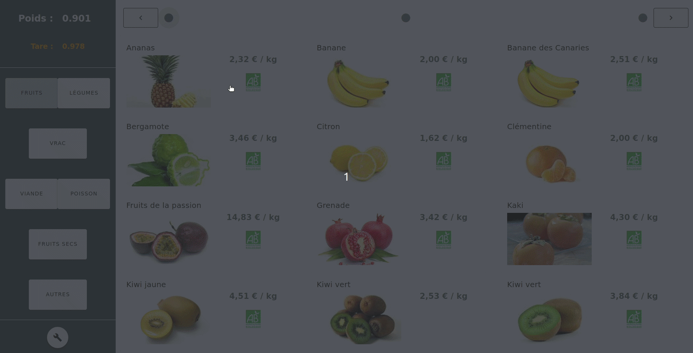

# Balance COOP
This is the scale service for La Chouette COOP.



### Requirement
You will need :
- docker
- docker-compose

It could make your life better:
- Pycharm (Python IDE)
- Insomnia (test API)

### Build

```bash
docker-compose build
```

### Run
This service needs a configuration file.
```yaml
odoo:
  url: https://sas.lachouettecoop.fr  # odoo URL
  db: dbsas                           # database used by odoo
  user: ...                           # username
  passwd: ...                         # password
  categories:
    fruits:                           # categories to show in UI
      - 337                           # list of corresponding cqteg_id
    legumes:
      - 418
  unp:                                # Unnecessary name parts (remove from product name in UI)
    - vrac
    - au kg
    - 1 kg

printer:                              # Printer IP
  ip: 192.168.70.106

scale:
  ip: 192.168.70.118:1240             # Scale IP

core:                                 # All options for development
  allow_all_origins: true
  cors_allowed_origins: "*"
  mock_printer: true
  mock_scale: true
```
Then run
```bash
docker-compose up -d
```

API will be accessible to http://localhost:5000/
```bash
curl http://localhost:5000/ping
```
It shall respond `{"name":"balance-coop","status":"ok"}`

### Development
```bash
poetry install
poetry run python main.py
```

### Scale
We use a Bizerba scale. This product can stream its screen on the port 1240.
We use this stream to get weight and tare.
This option shall be activated on the device.

### Printer
We use an Epson TM T88v-i. It's a network printer.
